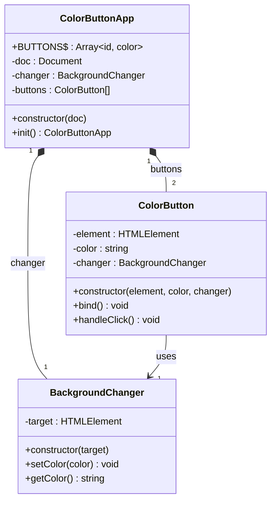

# UML Class Diagram — Class-Based Two-Button Website

Source: `website/color-buttons-app/public/js/colorButtons.js`

```mermaid
classDiagram
    class ColorButtonApp {
        +BUTTONS$ : Array~id, color~
        -doc : Document
        -changer : BackgroundChanger
        -buttons : ColorButton[]
        +constructor(doc)
        +init() ColorButtonApp
    }
    class ColorButton {
        -element : HTMLElement
        -color : string
        -changer : BackgroundChanger
        +constructor(element, color, changer)
        +bind() void
        +handleClick() void
    }
    class BackgroundChanger {
        -target : HTMLElement
        +constructor(target)
        +setColor(color) void
        +getColor() string
    }
    ColorButtonApp "1" *-- "2" ColorButton : buttons
    ColorButtonApp "1" *-- "1" BackgroundChanger : changer
    ColorButton --> "1" BackgroundChanger : uses
```
